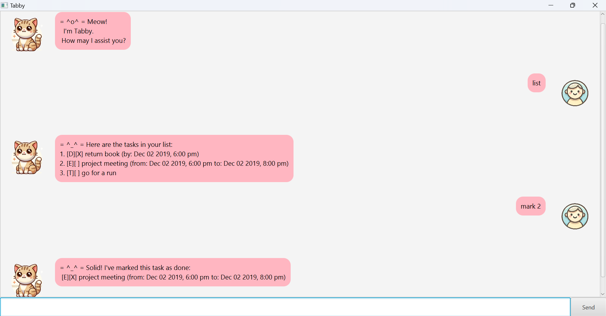

# Tabby Chatbot User Guide

Tabby is a chatbot that helps users manage their tasks efficiently. It supports **To-Dos, Deadlines, and Events**, making task tracking simple and organized.



## Installation

1. Ensure you have **Java 11 or later** installed on your computer
2. Download the latest `tabby.jar` file from [Releases](https://github.com/varsha13152/ip/releases)
3. Open a command terminal and navigate to the folder containing `tabby.jar`
4. Run the following command to start Tabby:

```sh
java -jar tabby.jar
```

## Available Commands

### Basic Commands

* **List Tasks**: View all your current tasks
  ```sh
  list
  ```

* **View Reminders**: Check upcoming deadlines and events that are not marked complete
  ```sh
  reminder
  ```

* **Find a Task**: Find a task using a keyword
  ```sh
  find <keyowrd>
  ```
  Example: `find run`

* **Exit Application**: Close Tabby
  ```sh
  bye
  ```

### Task Management

* **Add To-Do**: Create a task
  ```sh
  todo <description>
  ```
  Example: `todo go for a run`
  

* **Add Deadline**: Create a task with a due date
  ```sh
  deadline <description> /by <dd/MM/yyyy> <hhmm>
  ```
  Example: `deadline return book /by 2/12/2019 1800`

  NOTE:
      You must input the flags in order as shown above (ie: description followed by '/by') & /by date time must be set in the future
    
  
* **Add Event**: Schedule an event with start and end times
  ```sh
  event <description> /from <dd/MM/yyyy> <hhmm> < /to <dd/MM/yyyy> <hhmm>
  ```
  Example: `event project meeting /from 2/12/2019 1800 /to 2/12/2019 2000`

  NOTE:
    You must input the flags in order as shown above (ie: '/from' followed by '/to') & /from and /to date time must be set in the future 
   

* **Mark Task as Done**: Complete a task
  ```sh
  mark <task number>
  ```
  Example: `mark 1`
  
* **Unmark Task**: Revert a task to incomplete status
  ```sh
  unmark <task number>
  ```
  Example: `unmark 1`

* **Delete Task**: Remove a task from your list
  ```sh
  delete <task number>
  ```
  Example: `delete 1`

## Data Storage and Management

Tabby manages your data with the following features:

* Automatic saving after every command execution
* Data storage in `tabby.txt` within the `data` folder
* Automatic file creation if `tabby.txt` is missing
* Manual editing support through any text editor (maintain file format to prevent corruption)
